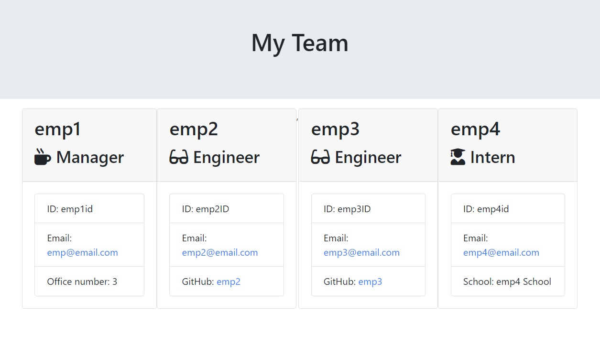

# Employee Team Generator 
   
The Employee Team is a Nodejs CLI HTML team generator application.  From a terminal window, the manager has the ability to generate an HTML file with their team members.  The app will ask the manager for the Employee's Name, ID, Email and Role.  Depending on tehir role, the app will ask additional pertinent information about the employee.  When the manager completes adding the team members, the app generates a html file the manager can render on a browser.

## Use and Images
   

    
     
## Installation
#### Dependencies
Nodejs
- inquirer
- jest
- path
#### Instructions
- Fork or copy the repository to a computer. 
- From a terminal, start node and run 'npm install'.
- 'npm test'
- 'npm app.js'

## Learning
Templates allow consistent html files and html DOM generation to be automated from input data.  Data input into the templates could come from user generated input (CLI or Forms), Third-Party web server API, files through network access storage and databases.  While this manual template generation method is a little cumbersome and would be difficult to maintain, I am learning to build templates more efficiently with maintenance manageability.

## Author
Michael Downs
[LinkedIn](http://www.linkedin.com/in/michaeldownssj)  
[GitHub](https://chindowns.github.io/) 